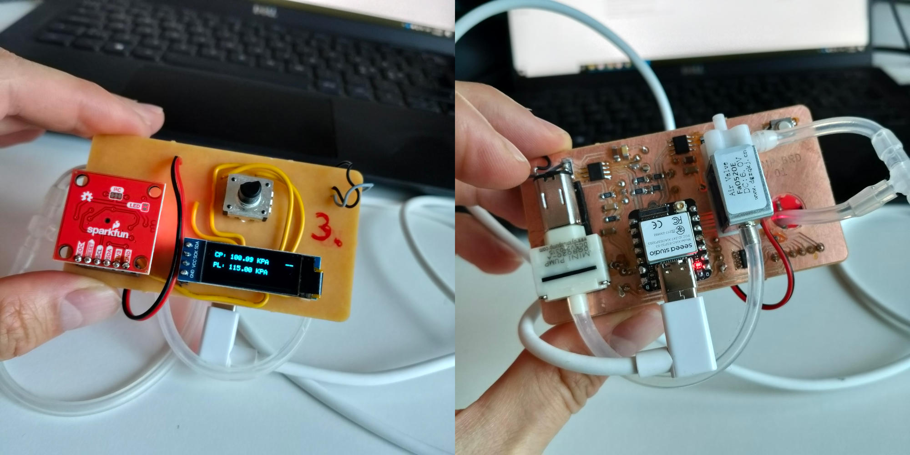

# Pumpsy

The pump board for your inflatable needs. 

## Introduction

Inflating things without control can be annoying. Pumpsy is a smart pump that makes prototyping inflatables much more fun. It allows to set a pressure limit dynamically and it remembers it even after a power-off. Among other features...

## Pumpsy Works

Pumpsy is simple. One button press to inflate, another one to deflate. Use the rotary encoder to set the pressure limit. Use the display to look at the numbers.

https://github.com/user-attachments/assets/6fe11480-7494-4fe5-9233-533023e13fa6

## Get Pumpsy

Pumpsy is experimental work in progress and we need you to show interest and support the project. Invite us for a workshop if you want to get your hands on the current version of Pumpsy. You can also show interest and accelerate the development by purchasing our merch!

- Buy our merch!
- Invite us for a workshop!
